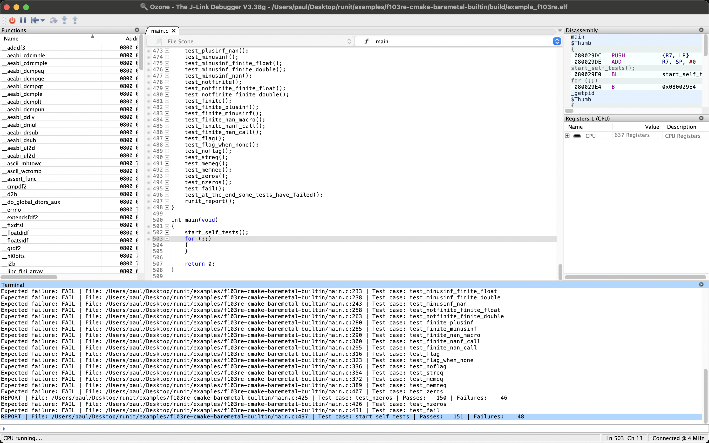

# Example for STM32F103RE

## Description
This example demonstrates a minimal bare-metal firmware project for the STM32F103RE microcontroller, using CMake for build configuration and targeting the ARM Cortex-M3 architecture. The project is structured to:

- **runit:** unit testing framework is included and used to run a simple self-test at startup, verifying that no tests have failed initially.
- **RTT Debug Output:** SEGGER RTT is included for real-time debug output.
- **CMSIS Support:** The ARM CMSIS library is fetched and included for core support and device headers.
- **CMake Cross-Compilation:** The CMakeLists.txt sets up the ARM GCC toolchain, compiler flags, and links the necessary libraries and startup files.
- **Project Entry Point:** The main.c file runs self-tests, reports results, and then enters an infinite loop.

This setup is ideal for developing and testing embedded firmware with automated unit tests, without relying on an operating system or external test runner.

## How to Build and Run this Example
1. **Tools:** Ensure you have CMake and the ARM GCC toolchain installed.
2. **Configure:** Create a build directory in this example's root directory. Run CMake to configure the project:
   ```bash
   $ mkdir build
   $ cd build
   $ cmake ..
   ```
3. **Build:** Compile the project:
   ```bash
   $ cmake --build .
   ```
4. **Run:** Execute the firmware (this may vary depending on your setup):
    
    Example for JLink with [OZONE](https://www.segger.com/downloads/jlink/#Ozone):
   - Open Ozone and create a new project.
   - Select the JLink debugger and the appropriate target device (STM32F103RE).
   - Add the compiled firmware binary (e.g., `example_f103re.elf`) to the project.
   - To show the RTT output, open `View -> Terminal` in Ozone.
   - Start a debug session to flash the firmware and run it on the target hardware.
   - In terminal, you should see the output from the RTT, including the results of the self-tests.
   

   Example for Jlink without Debugger:
   - Install [Jlink Software](https://www.segger.com/downloads/jlink/) for your System.
   - Connect your STM32F103RE board to your computer via JLink.
   - Use JFlashLite to flash the firmware `example_f103re.hex` or `example_f103re.bin` (to 0x08000000).
   - Reset the board to start the firmware.
   - Use `JLinkRTTViewer` to view the RTT output.
   - In terminal, you should see the output from the RTT, including the results of the self-tests.
   